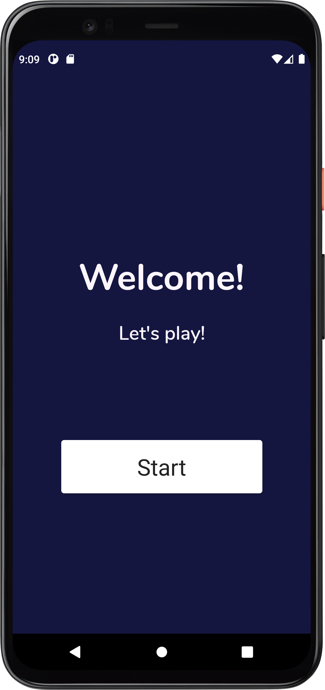
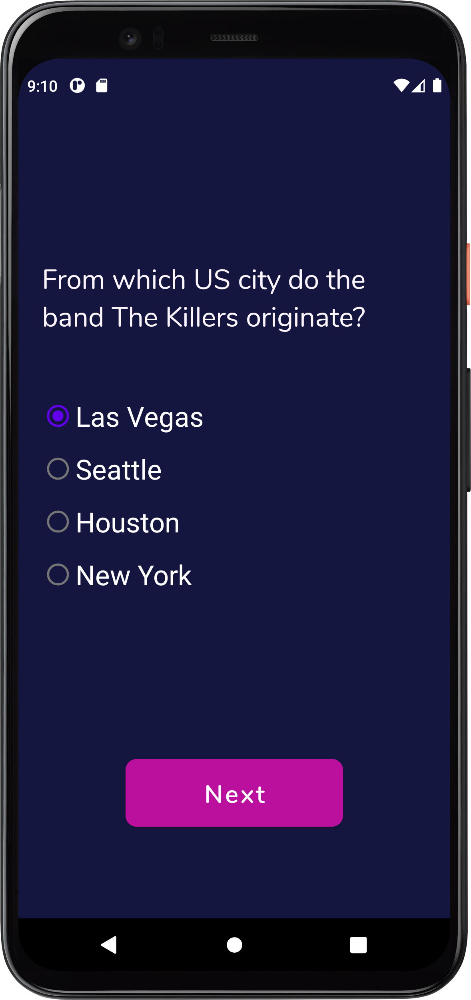
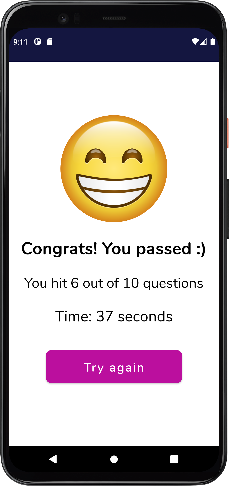

# Quiz App

Neste quiz há 10 questões a serem respondidas onde cada acerto vale 1 ponto. Se a resposta estiver errada não é 
contabilizado nenhum ponto. 

As questões são de conhecimento geral, ou seja, não possuem categoria específica.

Ao final, são mostradas as estatísticas, tais como a pontuação e o tempo, em segundos, que o jogador 
levou para responder o quiz.

A ordem das perguntas é diferente todas as vezes e não são exibidas perguntas duplicadas.

||
||

## Instalação

Para usar o app, basta fazer o download dos arquivos, abrir com o Android Studio e 
executar o app em um emulador ou aparelho físico.

Para este projeto, utilizei as perguntas do link https://www.radiotimes.com/quizzes/pub-quiz-general-knowledge/